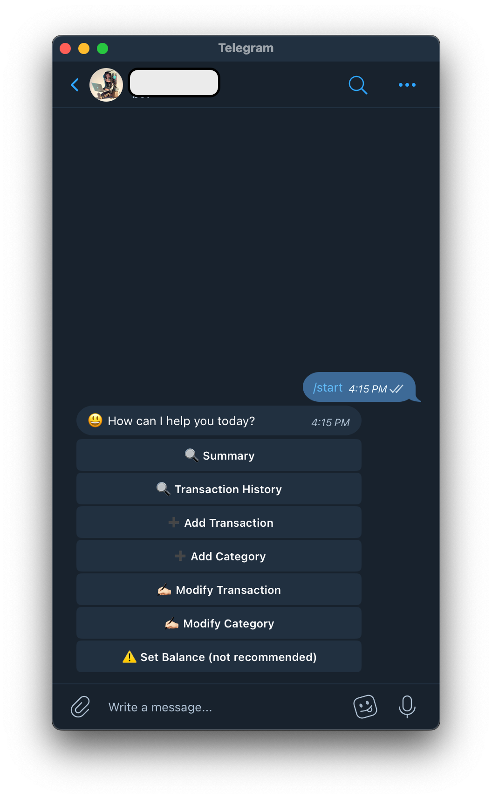
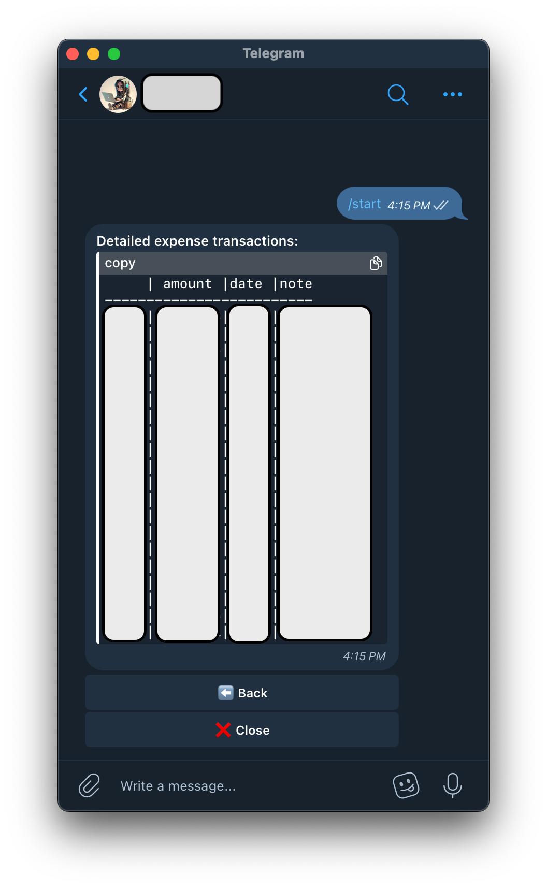
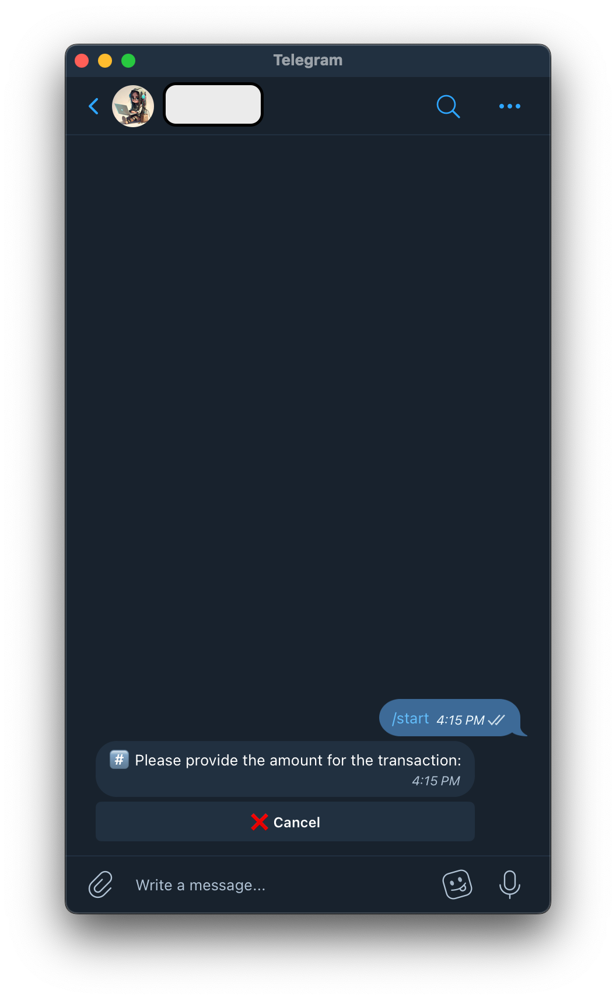

# Financial Bot
by [**@nhduong**](emailto:nhduong_3010@live.com)  
updated on 2024-11-29

## Introduction
This is a simple Telegram-based financial bot that helps you manage your personal finance. It can track your expenses, income, and savings. Main features include:
- Track your expenses and income month by month
- View your transaction history
- Add, edit, and delete:
    - Expense
    - Income
    - Category
- Interact via Telegram with your own bot. So you can access your financial data from anywhere.
- All the data is stored in a local SQLite database in your computer. So you don't have to worry about your data being leaked.

<div style="display: flex; flex-wrap: wrap; justify-content: space-between;">
    
    
    
    
</div>

## Installation
1. Clone this repository to your local machine.
2. Install the required packages:
    ```bash
    pip install -r requirements.txt
    ```
3. Open `fibot.py` and modify lines 21-27:
    ```python
    USER_ID_1 = 1234567890 # Add your telegram user ID #1 here
    USER_ID_2 = 1234567891 # Add your telegram user ID #2 here

    USER_NAME_1 = "ABC" # Your name #1 (any string)
    USER_NAME_2 = "DEF" # Your name #2 (any string)

    TOKEN = 'add your telegram bot token here'
    ```
    + For `USER_ID_1` and `USER_ID_2`, you can get your personal Telegram ID by sending a message to one of the following bots `@userinfobot` or `@getidsbot`.
    + For `TOKEN`, you need to create a new bot on Telegram. Follow the instructions [here](https://core.telegram.org/bots/tutorial#getting-ready) to create a new bot and get the token.
    + For `USER_NAME_1` and `USER_NAME_2`, you can put any string you want. This is just for the bot to know who you are.  
    **Note**: Note that here two users are supported. If you want to add more users, you can modify the code accordingly.
1. Run the bot:
    ```bash
    python fibot.py
    ```
4. Open Telegram and find your bot. Start chatting with your bot using `/start` command.
5. Enjoy!

## To-Do
Integrating large language models to provide more intelligent responses.

## License
This project is licensed under the terms of the MIT license.